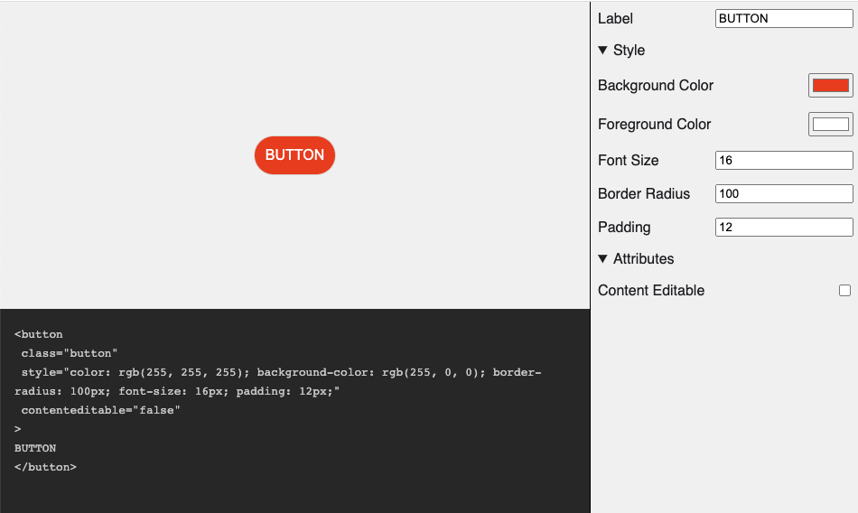

# HTML Element Sandbox



```html
<html-element-sandbox>
  <template>
    <button
      class="button"
      data-knob-text="label"
      data-knob-css-color="fg-color"
      data-knob-css-background-color="bg-color"
      data-knob-css-border-radius="shape"
      data-knob-css-font-size="text-font-size"
      data-knob-css-padding="padding"
      data-knob-css---shadow-color="shadow"
    >
      My Button
    </button>
    <style>
      .button {
        --shadow-color: #000;
        --elevation: 3px;
        display: block;
        width: 100%;
        height: 100%;
        border: none;
        background-color: transparent;
        cursor: pointer;
        box-shadow: 0 var(--elevation) calc(var(--elevation) * 2) 0 var(--shadow-color);
      }
    </style>
  </template>
  <div slot="knobs">
    <knob-string id="label" name="Label" value="BUTTON"></knob-string>
    <knob-group name="Style" expanded>
      <knob-color
        id="bg-color"
        name="Background Color"
        value="#ff0000"
      ></knob-color>
      <knob-color
        id="fg-color"
        name="Foreground Color"
        value="#ffffff"
      ></knob-color>
      <knob-color id="shadow" name="Shadow Color" value="#000000"></knob-color>
      <knob-number
        id="text-font-size"
        name="Font Size"
        value="16"
        suffix="px"
      ></knob-number>
      <knob-number
        id="shape"
        name="Border Radius"
        value="100"
        suffix="px"
      ></knob-number>
      <knob-number
        id="padding"
        name="Padding"
        value="12"
        suffix="px"
      ></knob-number>
    </knob-group>
  </div>
</html-element-sandbox>
<script
  type="module"
  src="https://rodydavis.github.io/html-element-sandbox/html-element-sandbox.es.js"
></script>
```
